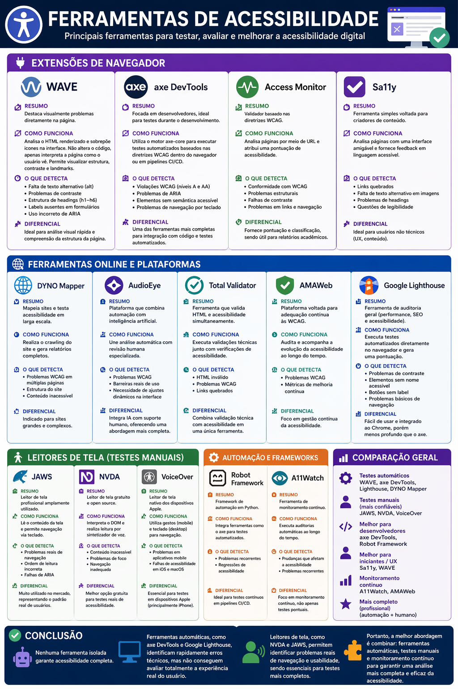

## Sobre esta pesquisa
 Uma frase descrevendo a dimensão e a pergunta central investigada.
## O que descobrimos (Principais Achados)
 3 a 5 bullet points com as descobertas mais relevantes.
 Cada bullet deve ter uma fonte citada.

## Ferramentas

## Testes em Sites do Grupo J&F
 
**Site analisado:** https://picpay.com/pt-br/pf  
**Data de coleta:** 19–20 de abril de 2026  
**Ferramentas utilizadas:** PageSpeed Insights (Google) e WebPageTest (Catchpoint)
 
> 📁 Na pasta `imagens/` estão as fotos dos testes realizados.
 
---
 
## 1. Scores de Acessibilidade
 
### 1.1 PageSpeed Insights
 
O PageSpeed Insights avalia acessibilidade em uma escala de 0 a 100. Veja os resultados abaixo:
 
| Contexto | Score | Interpretação |
|---|---|---|
| Desktop | 88 / 100 | Aceitável, mas abaixo do ideal (meta: acima de 90) |
| Mobile | 77 / 100 | Problemático — barreiras reais para usuários com deficiência |
 
O score mobile de **77/100** é o mais preocupante. Para um aplicativo financeiro com milhões de usuários, esse nível de acessibilidade indica que parte significativa dos usuários com deficiência encontra dificuldades no celular — justamente o dispositivo mais usado para acessar o PicPay.
 
### 1.2 WebPageTest (Catchpoint)
 
O WebPageTest, executado em **iPhone 15 com Chrome v145**, identificou **5 problemas de acessibilidade, sendo 2 classificados como críticos**. O relatório os aponta na categoria *"Is It Usable?"*, com status *"Not Bad"* — indicando que o site funciona, mas com ressalvas importantes.
 
---
 
## 2. Erros de Acessibilidade Encontrados
 
### 2.1 Tabela de erros, impactos e soluções
 
| Tipo de Erro | Gravidade | Impacto para o Usuário | Proposta de Solução |
|---|---|---|---|
| Imagens sem texto alternativo (`alt`) | 🔴 Crítico | Usuários cegos com leitores de tela não conseguem entender o conteúdo visual | Adicionar o atributo `alt` descritivo em todas as tags ``. Ex: `alt="Pessoa usando o app PicPay no celular"` |
| Elementos interativos sem rótulo (`aria-label`) | 🔴 Crítico | Botões e links sem nome legível impedem navegação por tecnologias assistivas | Adicionar `aria-label` ou `aria-labelledby` em todos os botões e links sem texto visível. Ex: `aria-label="Abrir menu de navegação"` |
| Contraste insuficiente entre texto e fundo | ⚠️ Moderado | Dificulta leitura para usuários com baixa visão ou daltonismo | Revisar a paleta de cores garantindo proporção mínima de contraste de **4,5:1** para texto normal e **3:1** para texto grande, conforme WCAG 2.1 |
| Estrutura de navegação inadequada para leitores de tela | ⚠️ Moderado | Dificulta orientação e navegação de usuários cegos na página | Usar elementos HTML semânticos corretos (`<nav>`, `<main>`, `<header>`, `<section>`) e garantir ordem lógica de foco via teclado (Tab) |
| HTML gerado por JavaScript (client-side rendering) | ⚠️ Moderado | Conteúdo pode não ser lido por tecnologias assistivas que não executam JS | Adotar **Server-Side Rendering (SSR)** ou **Static Site Generation (SSG)** para que o HTML chegue pronto ao navegador, sem depender de JS |
 
### 2.2 Por que o HTML gerado por JS é um problema de acessibilidade
 
O WebPageTest identificou que o HTML da página é gerado após a entrega — ou seja, o site usa JavaScript para montar seu conteúdo. Isso é um problema de acessibilidade porque:
 
- Leitores de tela antigos ou mal configurados podem não aguardar o JS carregar
- O conteúdo pode aparecer fora de ordem para tecnologias assistivas
- Em conexões lentas, o usuário com deficiência fica sem conteúdo por mais tempo
---
 
## 3. Problemas Mais Graves e Por Quê
 
| # | Problema | Nível | Por que é grave |
|---|---|---|---|
| 1 | Score de acessibilidade mobile: 77/100 | 🔴 Crítico | Exclui usuários com deficiência de um serviço financeiro essencial no dispositivo mais usado |
| 2 | 2 problemas críticos identificados pelo WebPageTest | 🔴 Crítico | Erros críticos bloqueiam completamente o acesso de certos grupos de usuários |
| 3 | HTML gerado por JavaScript | 🟠 Alto | Compromete acessibilidade e resiliência; conteúdo pode não ser acessível para tecnologias assistivas |
| 4 | Score de acessibilidade desktop: 88/100 | ⚠️ Moderado | Abaixo do recomendado mesmo no ambiente mais favorável |
  
### Extensões de Navegador
#### WAVE
**Resumo:**
Destaca visualmente problemas diretamente na página.

**Como funciona:**
Analisa o HTML renderizado e sobrepõe ícones na interface. Não altera o código, apenas interpreta a página como o usuário vê. Permite visualizar estrutura, contraste e landmarks.
 
**O que detecta:**
- Falta de texto alternativo (alt) 
- Problemas de contraste 
- Estrutura de headings (h1–h6) 
- Labels ausentes em formulários 
- ARIA mal utilizado 

**Diferencial:**
Melhor ferramenta para análise visual rápida e compreensão da estrutura da página.

**Browsers suportados:**
- Google Chrome
- Mozilla Firefox

#### axe DevTools
**Resumo:**
Focada em desenvolvedores, ideal para testes durante o desenvolvimento.

**Como funciona:**
Usa o motor do axe-core para rodar testes automatizados baseados nas WCAG dentro do navegador ou CI/CD.
    
**O que detecta:**
- Violações WCAG (níveis A, AA) 
- Problemas de ARIA 
- Elementos sem acessibilidade semântica 
- Problemas de navegação por teclado 
**Diferencial:**
Uma das mais completas para integração com código e testes automatizados.

**Browsers suportados:**
- Google Chrome
- Mozilla Firefox
- Microsoft Edge

#### Access Monitor
**Resumo:**
Validador baseado nas diretrizes WCAG.

**Como funciona:**
Analisa páginas via URL e atribui uma pontuação de acessibilidade.

**O que detecta:**
- Conformidade WCAG 
- Problemas estruturais 
- Falhas de contraste 
- Links e navegação 

**Diferencial:**
Fornece pontuação e classificação, útil para relatórios acadêmicos.

**Browsers suportados:**
Funciona via navegador (web), compatível com qualquer browser moderno como:
- Google Chrome
- Mozilla Firefox
- Microsoft Edge
- Safari

#### Sa11y
**Resumo:**
Ferramenta simples para criadores de conteúdo.

**Como funciona:**
Interface amigável que analisa páginas e dá feedback em linguagem simples.

**O que detecta:**
- Links quebrados 
- Falta de alt em imagens 
- Problemas de headings 
- Legibilidade 

**Diferencial:**
Melhor para não desenvolvedores (UX, conteúdo).

**Browsers suportados:**
Não é extensão tradicional, funciona dentro de sites/CMS (independente do browser)
    
### Ferramentas Online e Plataformas
#### DYNO Mapper
**Resumo:**
Mapeia sites e testa acessibilidade em escala.

**Como funciona:**
Faz crawling do site e gera relatórios completos.

**O que detecta:**
- Problemas WCAG em múltiplas páginas 
- Estrutura do site 
- Conteúdo inacessível 

**Diferencial:**
Ideal para sites grandes.

**Browsers suportados:**
Funciona em qualquer navegador moderno 
    
#### AudioEye
**Resumo:**
Plataforma com automação + IA.

**Como funciona:**
Combina análise automática com revisão humana.

**O que detecta:**
- Problemas WCAG 
- Barreiras reais de uso 
- Ajustes dinâmicos na interface 

**Diferencial:**
Inclui IA + suporte humano, algo que outras não têm.

**Browsers suportados:**
Compatível com qualquer navegador moderno 
    
#### Total Validator
**Resumo:**
Valida HTML + acessibilidade.
**Como funciona:**
Executa validações técnicas e acessibilidade juntas.

**O que detecta:**
- HTML inválido 
- WCAG 
- Links quebrados 

**Diferencial:**
Combina validação técnica + acessibilidade.

**Browsers suportados:**
Aplicação desktop + navegador, geralmente usado com Google Chrome 
      
#### AMAWeb

**Resumo:**
Plataforma para adequação às WCAG.

**Como funciona:**
Audita e acompanha evolução da acessibilidade.

**O que detecta:**
- Problemas WCAG 
- Métricas de melhoria contínua 

**Diferencial:**
Foco em gestão contínua de acessibilidade.

**Browsers suportados:**
Compatível com qualquer navegador moderno 
    
#### Google Lighthouse
**Resumo:**
Auditoria geral (performance, SEO, acessibilidade).

**Como funciona:**
Executa testes automatizados e gera score.

**O que detecta:**
- Contraste 
- Elementos sem nome acessível 
- Botões sem label 
- Navegação básica 

**Diferencial:**
Fácil de usar e integrado ao Chrome, mas menos profundo que axe.

**Browsers suportados:**
Integrado ao Google Chrome (DevTools), também via CLI

### Leitores de Tela (Testes Manuais)
#### JAWS
**Resumo:**
Leitor de tela profissional.

**Como funciona:**
Lê o conteúdo da tela e permite navegação por teclado.

**O que detecta:**
- Problemas reais de navegação 
- Ordem de leitura incorreta 
- Falhas de ARIA 

**Diferencial:**
Muito usado no mercado → padrão real de usuários.

**Browsers suportados:**
Funciona melhor com:
- Google Chrome
- Mozilla Firefox
- Microsoft Edge
  
#### NVDA
**Resumo:**
Leitor gratuito e open source.

**Como funciona:**
Interpreta o DOM e lê via sintetizador de voz.

**O que detecta:**
- Conteúdo inacessível 
- Problemas de foco 
- Navegação ruim 

**Diferencial:**
Melhor opção gratuita para testes reais.

**Browsers suportados:**
- Google Chrome
- Mozilla Firefox (melhor suporte)
- Microsoft Edge

#### VoiceOver
**Resumo:**
Leitor nativo Apple.

**Como funciona:**
Baseado em gestos (mobile) e teclado (desktop).

**O que detecta:**
- Problemas em apps mobile 
- Falta de acessibilidade em iOS/macOS 

**Diferencial:**
Essencial para testes mobile (iPhone).

**Browsers suportados:**
- Safari (melhor experiência)
- Google Chrome

### Automação e Frameworks
#### Robot Framework
**Resumo:**
Framework de automação em Python.

**Como funciona:**
Integra ferramentas como axe para testes automatizados.

**O que detecta:**
- Problemas recorrentes 
- Regressões de acessibilidade 

**Diferencial:**
Ideal para testes contínuos (CI/CD).

**Browsers suportados:**
Independente de browser (depende das ferramentas integradas, como Selenium)

#### A11Watch
**Resumo:**
Monitoramento contínuo.

**Como funciona:**
Executa auditorias automáticas ao longo do tempo.

**O que detecta:**
- Mudanças que quebram acessibilidade 
- Problemas recorrentes 

**Diferencial:**
Foco em monitoramento contínuo, não só testes pontuais.

**Browsers suportados:**
Compatível com qualquer navegador moderno

### Conclusão
Nenhuma ferramenta sozinha garante acessibilidade completa.
Ferramentas automáticas, como axe DevTools e Lighthouse, identificam erros técnicos rapidamente, mas não conseguem avaliar totalmente a experiência real do usuário.

Já leitores de tela, como NVDA e JAWS, permitem identificar problemas reais de navegação e usabilidade, sendo essenciais para testes mais completos.

## Infográfico da pesquisa realizada


## Como isso afeta o nosso trabalho como desenvolvedores
Após a pesquisa, a turma deve mudar a forma de desenvolver: acessibilidade não é um ajuste final, mas parte do processo desde o início. Abaixo estão práticas essenciais que devem ser adotadas.

 #### 1. Usar HTML semântico (evitar “gambiarras” com `<div>`)

 Antes (errado):

 `<div onclick="comprar()">Comprar</div>`

 Depois (certo):

 `<button onclick="comprar()">Comprar</button>`

 Explicação:
 O `<button>`:
 - É conhecido por leitores de tela
 - Funciona automaticamente com teclado (Enter/Espaço)
 
 A `<div>` não possui esses comportamentos por padrão.


 #### 2. Garantir a navegação por teclado
 
Testar e desenvolver pensando em usuários que não utilizam mouse.

 Exemplo: 

```html
<button id="menuBtn" aria-expanded="false" aria-controls="menu">Abrir menu</button>
<nav id="menu" hidden>
  <a href="#">Início</a>
  <a href="#">Perfil</a>
</nav>
```
```javascript
const btn = document.getElementById("menuBtn");
const menu = document.getElementById("menu");

btn.addEventListener("click", () => {
  const aberto = menu.hasAttribute("hidden");
  
  if (aberto) {
    menu.removeAttribute("hidden");
    btn.setAttribute("aria-expanded", "true");
    menu.querySelector("a").focus();
  } else {
    menu.setAttribute("hidden", "");
    btn.setAttribute("aria-expanded", "false");
    btn.focus();
  }
});
```

O que mudou:
- Uso de aria-expanded (É um atributo ARIA que indica se um elemento está aberto ou fechado)
- Controle de foco com `.focus()` (Um método do JavaScript que coloca o foco em um elemento)
- Interface funcional sem mouse
 
#### 3. Adicionar atributos de acessibilidade (ARIA)

ARIA (Accessible Rich Internet Applications)

É um conjunto de atributos que melhoram a acessibilidade de elementos na web.

- Fornece informações extras para tecnologias assistivas (como leitores de tela)
- Não muda o visual, mas muda como o conteúdo é interpretado


Exemplo:

```html
<button aria-expanded="false" aria-controls="faq1" onclick="toggleFaq(this)">
  Ver resposta
</button>

<div id="faq1" hidden>
  Esta é a resposta da pergunta.
</div>
```
```javascript
function toggleFaq(btn) {
  const conteudo = document.getElementById(btn.getAttribute("aria-controls"));

  const aberto = btn.getAttribute("aria-expanded") === "true";

  btn.setAttribute("aria-expanded", !aberto);
  conteudo.hidden = aberto;
}
```
Isso é importante pois os leitores de tela conseguem entender se um elemento está aberto/fechado.

#### 4. Testar manualmente
Não confiar apenas em ferramentas automáticas.

Práticas simples:
- Navegar usando apenas Tab, Enter e Shift + Tab
- Verificar se todas as funções são acessíveis
- Testar com leitor de tela (ex: NVDA)

#### Depois da pesquisa, a turma deve:
- parar de pensar só no visual e focar no significado do código
- Garantir que tudo funcione sem mouse
- Incluir acessibilidade no processo desde o início

## Referências
 Todas as fontes no formato: Autor/Organização. Título. Ano. URL.
 Mínimo: 5 fontes. Pelo menos 1 acadêmica ou    
 *Fonte dos dados:*
  PageSpeed Insights (Google) e WebPageTest (Catchpoint) | Coleta: 19–20 de abril de 2026